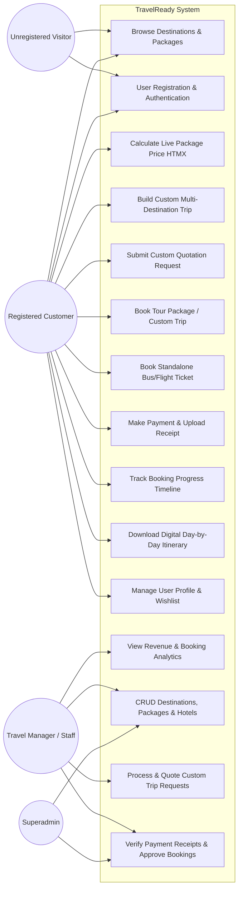
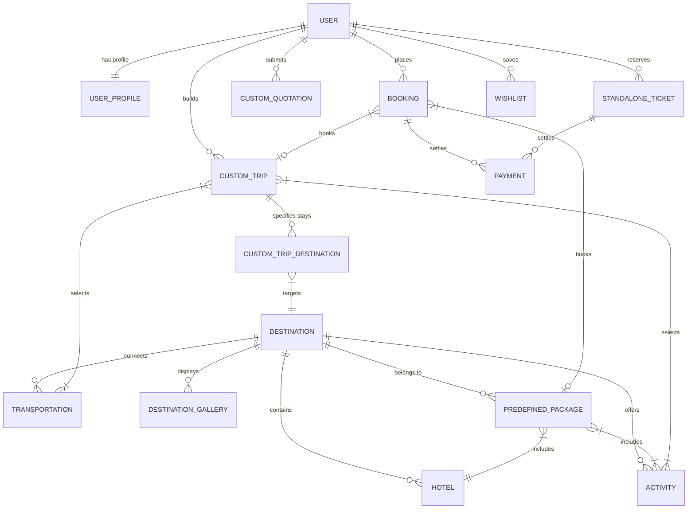
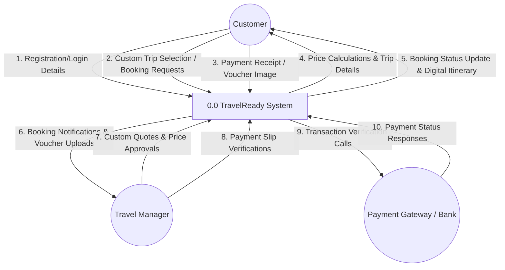
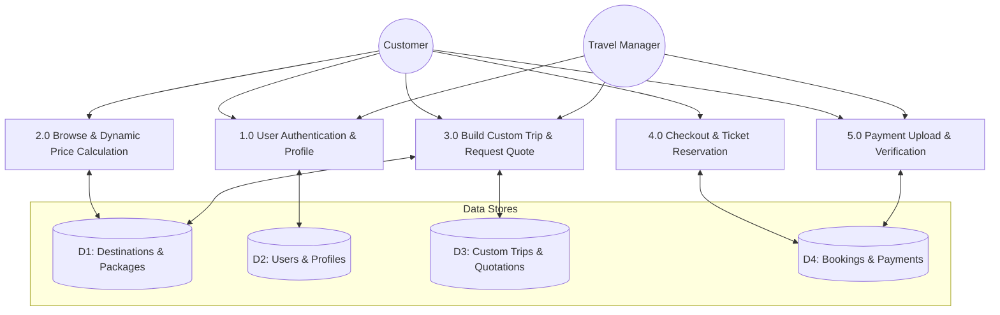
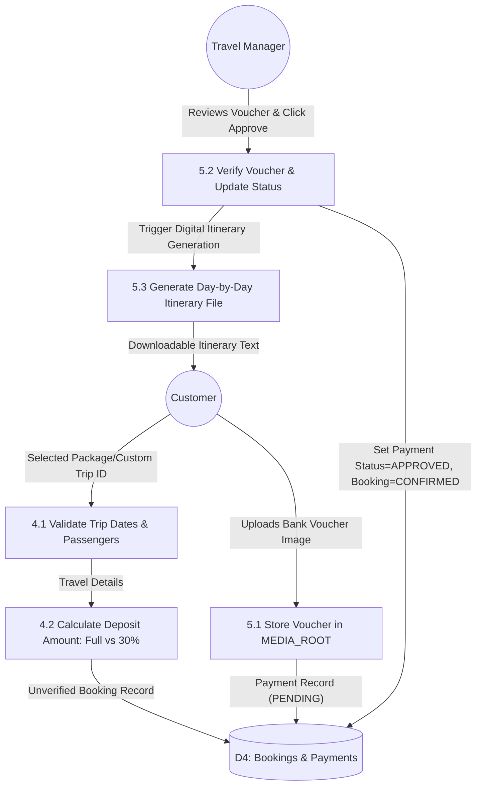

# TravelReady — Comprehensive Tour & Travel Management + Custom Trip Builder System

> **Academic & Technical Project Documentation**  
> **Framework:** Django (Python 3.10+) | **Frontend:** HTML5, CSS3, Bootstrap 5.3, HTMX 1.9.6, Vanilla JS | **Database:** SQLite3

---

## 📋 Table of Contents
1. [Project Overview & Objectives](#1-project-overview--objectives)
2. [Complete System Features](#2-complete-system-features)
3. [System Architecture & Tech Stack](#3-system-architecture--tech-stack)
4. [Two-Tier Administrative Architecture](#4-two-tier-administrative-architecture)
5. [Academic System Diagrams (Detailed Specifications)](#5-academic-system-diagrams)
   - [5.1 Use Case Diagram Specification](#51-use-case-diagram-specification)
   - [5.2 Entity-Relationship (ER) Diagram Specification](#52-entity-relationship-er-diagram-specification)
   - [5.3 Relational Database Schema Diagram Specification](#53-relational-database-schema-diagram-specification)
   - [5.4 Data Flow Diagrams (DFD Level 0, Level 1 & Level 2)](#54-data-flow-diagrams-dfd)
6. [Complete Database Data Dictionary](#6-complete-database-data-dictionary)
7. [URL Routing & Endpoints Reference](#7-url-routing--endpoints-reference)
8. [Directory & Project File Structure](#8-directory--project-file-structure)
9. [Installation, Setup & Data Seeding Guide](#9-installation-setup--data-seeding-guide)
10. [Test Credentials Matrix](#10-test-credentials-matrix)

---

## 1. Project Overview & Objectives

**TravelReady** is a full-stack, production-ready web application designed for comprehensive tour and travel management. It combines predefined tour package bookings, standalone transport ticket reservation (Bus/Flight), and an interactive **Multi-Destination Custom Trip Builder** ("Build My Trip") with live pricing recalculations.

### Key Objectives:
- Provide customers with seamless online tour package browsing, custom trip itinerary construction, ticket booking, and online/offline payment processing.
- Offer dynamic live price calculations without full page reloads using **HTMX**.
- Provide travel managers with a dedicated **Web Admin Panel** for managing destinations, ready-made packages, customer quotations, payment voucher verification, and revenue analytics.

---

## 2. Complete System Features

### 🌟 Public Portal & Customer Features
1. **Interactive Homepage (`/`)**:
   - Hero banner with HTMX live search by destination, date, and traveler count.
   - Categorized grids for **Inside Country** (e.g., Sauraha, Chitwan, Pokhara, Kathmandu) and **Outside Country** (e.g., Dubai, Bangkok, Delhi).
   - Testimonial section and interactive process workflow cards.
2. **User Authentication (`/accounts/`)**:
   - Customer registration, login, logout, and profile management with file uploads for profile avatars.
3. **Destination Detail & Dynamic Price Calculator (`/destinations/<slug>/`)**:
   - Bootstrap carousel gallery, travel guidelines, best travel seasons, and activities.
   - Dynamic HTMX Price Calculator: Live cost breakdown recalculation based on days, package tier (Single/Couple/Family), hotel category, activities, and transport modes.
4. **Interactive "Build My Trip" Custom Package Builder ⭐ (`/builder/`)**:
   - Multi-destination route selector with per-place day allocation.
   - Component customizer: Hotel tiers (Budget, 3-Star, 4-Star, Luxury), activity checklists, and transport modes per segment.
   - Itemized real-time pricing breakdown including taxes and service charges.
5. **Custom Quotation Request System (`/quotation/request/`)**:
   - Custom travel requests for special routes or budgets submitted directly to travel managers.
6. **Online Booking & Checkout (`/booking/checkout/`)**:
   - Complete traveler details, emergency contacts, travel date selection.
   - Payment options: **Full Payment** or **30% Advance Deposit**.
   - Auto-generation of unique Booking Reference IDs (`TRV-YYYY-XXXXX`).
7. **Standalone Transport Ticket Booking (`/tickets/`)**:
   - Search and book standalone Bus and Flight tickets with operator selection and seat counts.
   - Unique Ticket Reference generation (`TKT-YYYY-XXXXX`).
8. **Payment Gateway & Receipt Upload (`/payments/`)**:
   - Simulated eSewa and Khalti payment gateway options.
   - Bank Transfer option with deposit voucher image upload (`MEDIA_ROOT`).
9. **Customer Dashboard (`/dashboard/`)**:
   - Overview stats, My Bookings timeline tracker (5-step progress bar), My Custom Trips, Quotation Inbox, My Tickets, Wishlist, Profile Settings.
   - **Digital Itinerary Generator**: Auto-generates downloadable/printable text itineraries for confirmed trips.

### 🛡️ Web Admin Panel Features (`/dashboard/admin/`)
1. **Analytics Dashboard**: Real-time revenue metrics, total booking counts, pending payments, and quote requests.
2. **Destination Manager**: Full CRUD management of inside/outside country destinations, rules, best season, and image uploads.
3. **Package & Hotel Tiers Manager**: Package pricing, per-day extra rates, activity assignments, and hotel per-night rates.
4. **Custom Quote Processor**: Review customer custom trip requests, set custom prices ($रु$), add admin notes, and dispatch formal quotes directly to user dashboards.
5. **Booking & Payment Approver**: Verify uploaded bank transfer vouchers, approve/reject transactions, mark bookings as `CONFIRMED`, and update payment status.

---

## 3. System Architecture & Tech Stack

```
                               ┌────────────────────────────────────────┐
                               │            Client Browser              │
                               │  HTML5 / Bootstrap 5.3 / HTMX / JS    │
                               └──────────────────┬─────────────────────┘
                                                  │ HTTP / HTMX AJAX
                                                  ▼
                               ┌────────────────────────────────────────┐
                               │             Django Core                │
                               │         Session Auth & Middleware       │
                               └──────────────────┬─────────────────────┘
                                                  │
                 ┌────────────────────────────────┴────────────────────────────────┐
                 ▼                                                                 ▼
   ┌──────────────────────────┐                                      ┌──────────────────────────┐
   │    Standard Views / CBVs │                                      │   HTMX Partial Views     │
   │  (HTML Template Rendering)│                                      │ (Dynamic Partial HTML)   │
   └─────────────┬────────────┘                                      └─────────────┬────────────┘
                 │                                                                 │
                 └────────────────────────────────┬────────────────────────────────┘
                                                  │ ORM Calls
                                                  ▼
                               ┌────────────────────────────────────────┐
                               │            SQLite Database             │
                               └────────────────────────────────────────┘
```

- **Backend Framework**: Native Django 6.0 (Python 3.10+) using standard views and Class-Based Views (CBVs) without DRF.
- **Frontend Engine**: HTML5, Vanilla CSS3 (`static/css/style.css`), Bootstrap 5.3 CSS & JS CDN, FontAwesome 6.5, Bootstrap Icons 1.11.
- **Interactivity**: **HTMX 1.9.6** for asynchronous live pricing calculations, search filters, and partial UI updates.
- **Database Engine**: Django SQLite Engine (`db.sqlite3`).
- **File & Media Storage**: Local filesystem via `MEDIA_ROOT` (`media/`) and `MEDIA_URL` (`/media/`).

---

## 4. Two-Tier Administrative Architecture

1. **Superadmin Portal (`/admin/`)**:
   - Low-level database management, raw Django User authentication models, permission groups, and system configuration.
2. **Custom Web Admin Panel (`/dashboard/admin/`)**:
   - Bootstrap-based dashboard tailored for travel agency staff.
   - Non-technical operations: verifying payment deposit slips, setting custom trip quote prices, adding destinations/packages, and monitoring sales.

---

## 5. Academic System Diagrams

*(Use the detailed specifications and Mermaid diagrams below for your academic reports, presentations, and design documentation).*

---

### 5.1 Use Case Diagram Specification

#### Actors Identified:
1. **Unregistered Visitor**: Browses home page, views destinations, predefined packages, and transport schedules.
2. **Registered Customer**: Registers/Logs in, uses "Build My Trip", requests quotations, books packages/tickets, submits payments, views booking progress timeline, downloads digital itineraries, manages wishlist and profile.
3. **Travel Manager / Staff Admin**: Logs into `/dashboard/admin/`, manages destinations/hotels/packages, reviews quotation requests, sets custom quotes, verifies payment receipts, approves bookings, views revenue analytics.
4. **Superadmin**: Accesses `/admin/`, manages database models, system configurations, and user permissions.

#### System Boundary: `TravelReady Web Application`



---

### 5.2 Entity-Relationship (ER) Diagram Specification

#### Entities & Key Relationships:
- **User (1)** ── (1) **UserProfile** (One-to-One)
- **User (1)** ── (N) **Booking** (One-to-Many)
- **User (1)** ── (N) **CustomTrip** (One-to-Many)
- **User (1)** ── (N) **CustomQuotationRequest** (One-to-Many)
- **User (1)** ── (N) **StandaloneTicket** (One-to-Many)
- **User (1)** ── (N) **Wishlist** (One-to-Many)
- **Destination (1)** ── (N) **Hotel** (One-to-Many)
- **Destination (1)** ── (N) **Activity** (One-to-Many)
- **Destination (1)** ── (N) **Transportation** (One-to-Many)
- **Destination (1)** ── (N) **DestinationGallery** (One-to-Many)
- **Destination (1)** ── (N) **PredefinedPackage** (One-to-Many)
- **PredefinedPackage (M)** ── (N) **Activity** (Many-to-Many)
- **CustomTrip (1)** ── (N) **CustomTripDestination** (One-to-Many join table)
- **CustomTrip (M)** ── (N) **Activity** (Many-to-Many)
- **CustomTrip (M)** ── (N) **Transportation** (Many-to-Many)
- **Booking (1)** ── (N) **Payment** (One-to-Many)
- **StandaloneTicket (1)** ── (N) **Payment** (One-to-Many)



---

### 5.3 Relational Database Schema Diagram Specification

Below is the complete database structure, primary keys (PK), foreign keys (FK), data types, and constraints:

```
+-----------------------------------------------------------------------------------+
|                                 USER (django_auth)                                |
+-----------------------------------------------------------------------------------+
| PK | id             | Integer       | Auto-increment                              |
|    | username       | Varchar(150)  | Unique                                      |
|    | email          | Varchar(254)  | User Email Address                          |
|    | password       | Varchar(128)  | Hashed Password                             |
|    | is_staff       | Boolean       | Staff status (Web Admin Panel access)       |
|    | is_superuser   | Boolean       | Superadmin status                           |
+-----------------------------------------------------------------------------------+
                                         │
                                         │ 1:1
                                         ▼
+-----------------------------------------------------------------------------------+
|                                   USER_PROFILE                                    |
+-----------------------------------------------------------------------------------+
| PK | id             | Integer       | Auto-increment                              |
| FK | user_id        | Integer       | FK -> User.id (Unique)                      |
|    | phone          | Varchar(20)   | Contact Phone                               |
|    | address        | Text          | Physical Address                            |
|    | profile_picture| ImageField    | Uploaded file path in MEDIA_ROOT            |
|    | date_of_birth  | Date          | Birth Date                                  |
|    | is_travel_agent| Boolean       | Travel Agent flag                           |
+-----------------------------------------------------------------------------------+

+-----------------------------------------------------------------------------------+
|                                    DESTINATION                                    |
+-----------------------------------------------------------------------------------+
| PK | id             | Integer       | Auto-increment                              |
|    | name           | Varchar(200)  | Destination Name                            |
|    | slug           | SlugField     | Unique URL slug                             |
|    | destination_type| Varchar(20)  | INSIDE_COUNTRY / OUTSIDE_COUNTRY            |
|    | location       | Varchar(200)  | Location/City                               |
|    | district       | Varchar(100)  | District/Region                             |
|    | description    | Text          | Detailed Description                        |
|    | main_image     | ImageField    | Main Destination Thumbnail                  |
|    | base_visit_cost| Decimal(10,2) | Base Entry/Visit Cost                       |
|    | best_season    | Varchar(100)  | Recommended Travel Months                   |
|    | status         | Varchar(20)   | Active / Inactive                           |
+-----------------------------------------------------------------------------------+
         │                           │                          │
         │ 1:N                       │ 1:N                      │ 1:N
         ▼                           ▼                          ▼
+-----------------------+   +-----------------------+   +-----------------------+
|         HOTEL         |   |       ACTIVITY        |   |    TRANSPORTATION     |
+-----------------------+   +-----------------------+   +-----------------------+
| PK | id         | Int |   | PK | id         | Int |   | PK | id         | Int |
| FK | dest_id    | Int |   | FK | dest_id    | Int |   | FK | dest_id    | Int |
|    | name       | Var |   |    | title      | Var |   |    | vehicle_type| Var |
|    | category   | Var |   |    | adult_price| Dec |   |    | route_origin| Var |
|    | per_night_ | Dec |   |    | child_price| Dec |   |    | per_person_ | Dec |
|    |   rate     |     |   |    | duration   | Dec |   |    | per_vehicle_| Dec |
+-----------------------+   +-----------------------+   +-----------------------+

+-----------------------------------------------------------------------------------+
|                                PREDEFINED_PACKAGE                                 |
+-----------------------------------------------------------------------------------+
| PK | id                 | Integer       | Auto-increment                          |
|    | title              | Varchar(200)  | Package Name                            |
|    | slug               | SlugField     | Unique URL Slug                         |
| FK | destination_id     | Integer       | FK -> Destination.id                    |
|    | package_type       | Varchar(20)   | SINGLE / COUPLE / FAMILY                |
|    | base_days          | Integer       | Standard Duration Days                  |
|    | base_price         | Decimal(10,2) | Package Base Price                      |
|    | per_day_extra_cost | Decimal(10,2) | Daily Extension Rate                    |
| FK | hotel_id           | Integer       | FK -> Hotel.id                          |
|    | is_popular         | Boolean       | Featured/Popular ribbon flag            |
+-----------------------------------------------------------------------------------+

+-----------------------------------------------------------------------------------+
|                                    CUSTOM_TRIP                                    |
+-----------------------------------------------------------------------------------+
| PK | id                 | Integer       | Auto-increment                          |
| FK | user_id            | Integer       | FK -> User.id                           |
|    | trip_name          | Varchar(200)  | Custom Trip Title                       |
|    | total_days         | Integer       | Total Calculated Days                   |
|    | hotel_category     | Varchar(20)   | BUDGET / THREE_STAR / FOUR_STAR / LUXURY|
|    | adults_count       | Integer       | Number of Adults                        |
|    | children_count     | Integer       | Number of Children                      |
|    | total_price        | Decimal(10,2) | Total Calculated Dynamic Price          |
|    | status             | Varchar(20)   | DRAFT / SAVED / CONVERTED               |
+-----------------------------------------------------------------------------------+

+-----------------------------------------------------------------------------------+
|                                      BOOKING                                      |
+-----------------------------------------------------------------------------------+
| PK | id                 | Integer       | Auto-increment                          |
|    | booking_id         | Varchar(20)   | Unique Ref: TRV-YYYY-XXXXX              |
| FK | user_id            | Integer       | FK -> User.id                           |
| FK | package_id         | Integer       | FK -> PredefinedPackage.id (Optional)   |
| FK | custom_trip_id     | Integer       | FK -> CustomTrip.id (Optional)          |
|    | travel_date        | Date          | Departure Date                          |
|    | return_date        | Date          | Return Date                             |
|    | adults_count       | Integer       | Adult Count                             |
|    | children_count     | Integer       | Child Count                             |
|    | total_cost         | Decimal(10,2) | Final Agreed Total Price                |
|    | status             | Varchar(20)   | PENDING/CONFIRMED/TRIP_STARTED/COMPLETED|
|    | payment_verified   | Boolean       | Deposit Verified Flag                   |
+-----------------------------------------------------------------------------------+
                                         │
                                         │ 1:N
                                         ▼
+-----------------------------------------------------------------------------------+
|                                      PAYMENT                                      |
+-----------------------------------------------------------------------------------+
| PK | id                 | Integer       | Auto-increment                          |
|    | payment_ref        | Varchar(30)   | Unique Ref: PAY-YYYYMMDD-XXXXX          |
| FK | booking_id         | Integer       | FK -> Booking.id (Optional)             |
| FK | ticket_id          | Integer       | FK -> StandaloneTicket.id (Optional)    |
| FK | user_id            | Integer       | FK -> User.id                           |
|    | amount             | Decimal(10,2) | Paid Amount                             |
|    | payment_option     | Varchar(20)   | FULL / PARTIAL_30                       |
|    | payment_method     | Varchar(20)   | ESEWA / KHALTI / BANK_TRANSFER          |
|    | transaction_ref    | Varchar(100)  | Gateway Transaction Ref Code            |
|    | payment_receipt    | ImageField    | Uploaded Voucher Image Path             |
|    | verification_status| Varchar(20)   | PENDING / APPROVED / REJECTED           |
+-----------------------------------------------------------------------------------+
```

---

### 5.4 Data Flow Diagrams (DFD)

#### 5.4.1 DFD Level 0 — Context Diagram
The Level 0 Context Diagram displays the entire TravelReady system as a single process interacting with external entities (Customer, Travel Manager, Payment Gateway).



#### 5.4.2 DFD Level 1 — Major Subsystems Flow
Decomposes the system into 5 primary operational processes and 4 data stores:



#### 5.4.3 DFD Level 2 — Detailed Sub-Process (Process 4.0 Checkout & Process 5.0 Payment Verification)



---

## 6. Complete Database Data Dictionary

| App Name | Model Name | Primary Key | Key Fields & Types | Purpose |
|---|---|---|---|---|
| `accounts` | `UserProfile` | `id` (Int) | `user` (FK User), `phone` (Char), `address` (Text), `profile_picture` (Image), `date_of_birth` (Date) | Extends Django built-in auth User with travel-related profile attributes. |
| `destinations` | `Destination` | `id` (Int) | `name`, `slug`, `destination_type` (Enum), `location`, `district`, `description`, `main_image`, `base_visit_cost` (Decimal), `best_season` | Stores inside/outside country travel destinations. |
| `destinations` | `DestinationGallery`| `id` (Int) | `destination` (FK Destination), `image` (Image) | Photo gallery images per destination. |
| `destinations` | `Hotel` | `id` (Int) | `destination` (FK Destination), `name`, `category` (BUDGET/THREE_STAR/FOUR_STAR/LUXURY), `per_night_rate` (Decimal), `room_types` | Lodging options per destination. |
| `destinations` | `Activity` | `id` (Int) | `destination` (FK Destination), `title`, `adult_price` (Decimal), `child_price` (Decimal), `duration_hours` | Local tour activities per place. |
| `destinations` | `Transportation` | `id` (Int) | `destination` (FK Destination), `route_origin`, `vehicle_type` (BUS/CAR/JEEP/FLIGHT), `per_person_price`, `per_vehicle_price` | Route segment transport pricing options. |
| `destinations` | `Wishlist` | `id` (Int) | `user` (FK User), `destination` (FK Destination), `added_at` | User saved destinations wishlist. |
| `packages` | `PredefinedPackage` | `id` (Int) | `title`, `slug`, `destination` (FK), `package_type` (SINGLE/COUPLE/FAMILY), `base_days`, `base_price`, `hotel` (FK), `included_activities` (M2M) | Ready-made agency tour packages. |
| `custom_trips` | `CustomTrip` | `id` (Int) | `user` (FK User), `trip_name`, `total_days`, `hotel_category`, `adults_count`, `children_count`, `total_calculated_price`, `status` | Saved custom multi-destination itineraries. |
| `custom_trips` | `CustomTripDestination`| `id` (Int) | `custom_trip` (FK), `destination` (FK), `stay_duration_days`, `order` | Ordered destination stays in custom trip. |
| `custom_trips` | `CustomQuotationRequest`| `id` (Int) | `user` (FK), `desired_route`, `travellers_count`, `budget`, `admin_quoted_price`, `generated_itinerary`, `status` | Non-standard trip quotation requests. |
| `bookings` | `Booking` | `id` (Int) | `booking_id` (`TRV-YYYY-XXXXX`), `user` (FK), `package` (FK), `custom_trip` (FK), `travel_date`, `return_date`, `total_cost`, `status`, `payment_verified` | Central booking records & progress state. |
| `tickets` | `StandaloneTicket` | `id` (Int) | `ticket_number` (`TKT-YYYY-XXXXX`), `user` (FK), `ticket_type` (BUS/FLIGHT), `origin`, `destination`, `travel_date`, `price`, `status` | Standalone bus and flight ticket bookings. |
| `tickets` | `TicketSchedule` | `id` (Int) | `ticket_type`, `operator_name`, `origin`, `destination`, `departure_time`, `price_per_person`, `available_seats` | Admin-configured bus/flight schedules. |
| `payments` | `Payment` | `id` (Int) | `payment_ref` (`PAY-YYYYMMDD-XXXXX`), `booking` (FK), `ticket` (FK), `user` (FK), `amount`, `payment_option` (FULL/PARTIAL_30), `payment_method`, `payment_receipt` (Image), `verification_status` | Deposit verification & transaction tracking. |

---

## 7. URL Routing & Endpoints Reference

| App Namespace | URL Pattern | View Function | Method | Description |
|---|---|---|---|---|
| `destinations_home` | `/` | `home` | GET | Homepage with HTMX search & featured cards. |
| `accounts` | `/accounts/register/` | `register` | GET/POST | User registration form & session login. |
| `accounts` | `/accounts/login/` | `LoginView` | GET/POST | Session authentication login. |
| `accounts` | `/accounts/logout/` | `custom_logout` | GET/POST | Session logout & redirect. |
| `accounts` | `/accounts/profile/` | `profile` | GET | Customer profile overview. |
| `accounts` | `/accounts/profile/edit/`| `profile_edit` | GET/POST | Customer profile details update & picture upload. |
| `destinations` | `/destinations/` | `destination_list` | GET | Destinations list filtered by type. |
| `destinations` | `/destinations/<slug>/` | `destination_detail` | GET | Destination details & live HTMX calculator. |
| `destinations` | `/destinations/<slug>/calculate-price/` | `calculate_price_htmx` | POST | HTMX live price calculation partial. |
| `packages` | `/packages/` | `package_list` | GET | Predefined tour packages listing grid. |
| `packages` | `/packages/<slug>/` | `package_detail` | GET | Predefined tour package detail view. |
| `custom_trips` | `/builder/` | `trip_builder` | GET | Multi-destination Custom Trip Builder UI. |
| `custom_trips` | `/builder/calculate/` | `calculate_trip_htmx` | POST | HTMX itemized custom trip price calculator. |
| `custom_trips` | `/builder/save/` | `save_custom_trip` | POST | Save custom trip itinerary to database. |
| `custom_trips` | `/builder/quotation/request/` | `quotation_request` | GET/POST | Submit custom quotation request form. |
| `bookings` | `/booking/checkout/` | `booking_checkout` | GET/POST | Booking checkout form & cost calculation. |
| `bookings` | `/booking/<pk>/` | `booking_detail` | GET | Booking progress timeline & status. |
| `bookings` | `/booking/<pk>/itinerary/`| `download_itinerary` | GET | Download generated text itinerary file. |
| `tickets` | `/tickets/` | `ticket_list` | GET | Bus and Flight schedules listing. |
| `tickets` | `/tickets/search/` | `ticket_search` | GET | Search bus/flight transport schedules. |
| `payments` | `/payments/booking/<booking_id>/` | `payment_page` | GET/POST | Payment selection & voucher image upload. |
| `dashboard` | `/dashboard/` | `dashboard_home` | GET | Customer Dashboard overview & stats. |
| `dashboard` | `/dashboard/admin/` | `admin_dashboard` | GET | Web Admin Panel sales & revenue analytics. |
| `dashboard` | `/dashboard/admin/payments/<pk>/verify/` | `admin_payment_verify` | GET/POST | Admin payment voucher verification & approval. |

---

## 8. Directory & Project File Structure

```
sarita/
├── manage.py
├── db.sqlite3
├── prompt.txt
├── first.md
├── second.md
├── README.md                          <-- (This comprehensive document)
├── core/                              <-- Django Core Config Directory
│   ├── __init__.py
│   ├── settings.py                    <-- Apps, static/media & auth settings
│   ├── urls.py                        <-- Root URL Routing configuration
│   ├── wsgi.py
│   └── asgi.py
├── apps/                              <-- Modular Django Applications
│   ├── accounts/                      <-- Auth, profiles, user/admin dashboard
│   ├── destinations/                  <-- Destinations, hotels, activities, transport
│   ├── packages/                      <-- Predefined tour packages
│   ├── custom_trips/                  <-- "Build My Trip" builder & quotation system
│   ├── bookings/                      <-- Package/custom trip booking & itineraries
│   ├── tickets/                       <-- Standalone bus/flight ticket booking
│   └── payments/                      <-- Payment gateway selection & voucher upload
├── templates/                         <-- Bootstrap 5 + HTMX Template Engine
│   ├── base.html                      <-- Primary master layout
│   ├── home.html                      <-- Interactive home page
│   ├── accounts/                      <-- Login, register, profile templates
│   ├── destinations/                  <-- Destination lists, details & HTMX partials
│   ├── packages/                      <-- Package list & detail templates
│   ├── custom_trips/                  <-- Interactive builder & quotation templates
│   ├── bookings/                      <-- Checkout, booking detail, success templates
│   ├── tickets/                       <-- Ticket schedules & reservation templates
│   ├── payments/                      <-- Payment form & success confirmation templates
│   └── dashboard/                     <-- User dashboard & Admin Panel templates
│       └── admin/                     <-- Dedicated Web Admin Panel UI templates
├── static/                            <-- Static Assets
│   └── css/style.css                  <-- Custom CSS styling & responsive layout overrides
└── media/                             <-- Uploaded User Files (MEDIA_ROOT)
    ├── destinations/
    ├── receipts/
    └── profiles/
```

---

## 9. Installation, Setup & Data Seeding Guide

### Prerequisites
- Python 3.10 or higher
- `pip` (Python package manager)

### Step 1: Clone & Navigate to Workspace
```bash
cd "c:\Users\DipeshDip\OneDrive\Desktop\Student Projects\sarita"
```

### Step 2: Install Django & Dependencies
```bash
pip install django Pillow
```

### Step 3: Run Database Migrations
```bash
python manage.py makemigrations
python manage.py migrate
```

### Step 4: Populate Seed Data (Destinations, Hotels, Packages, Users)
```bash
python manage.py seed_data
```

### Step 5: Start Development Server
```bash
python manage.py runserver 8000
```
Open your browser and navigate to: **`http://127.0.0.1:8000/`**

---

## 10. Test Credentials Matrix

| User Role | Username | Password | Email | Access Scope |
|---|---|---|---|---|
| **Superadmin / Staff** | `admin` | `admin123` | `admin@travelready.com` | Full access to `/dashboard/admin/` and `/admin/` |
| **Test Customer** | `customer` | `customer123` | `customer@travelready.com` | Customer dashboard `/dashboard/`, builder, bookings |

---
*Documentation generated for TravelReady system report.*
