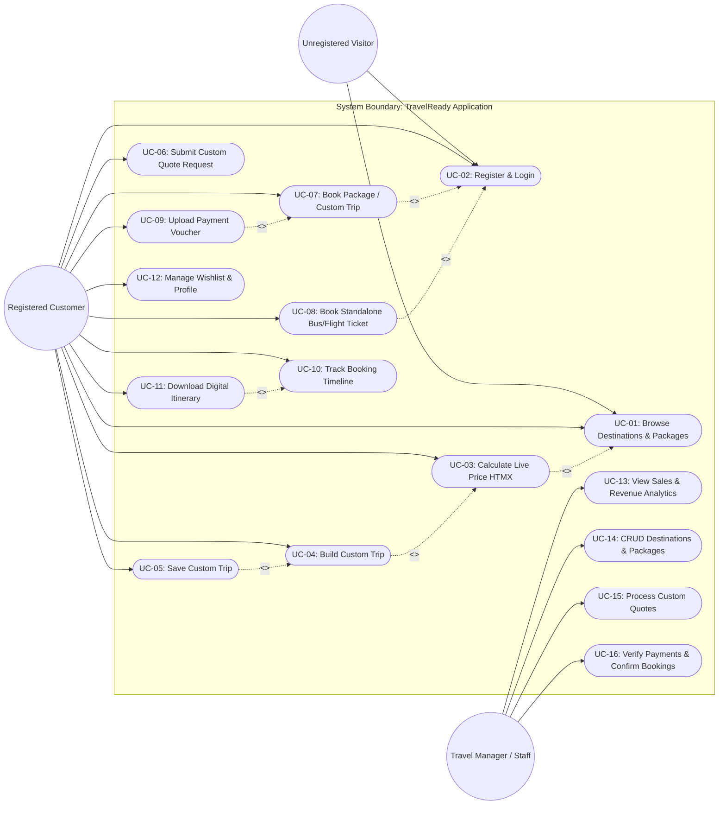
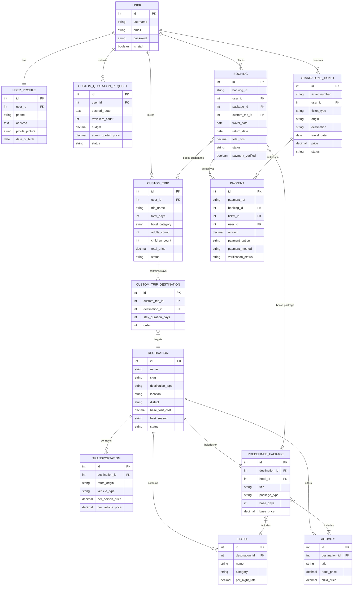

# TravelReady — System Diagram Specifications (`images.md`)

This document provides exhaustive, step-by-step specifications for constructing the **Use Case Diagram** and **Entity-Relationship (ER) Diagram** for the **TravelReady** system. Use these specifications to easily draw the diagrams in tools such as **Draw.io**, **Lucidchart**, **StarUML**, or **Visual Paradigm**.

---

## 🎭 1. Use Case Diagram Specification

### 1.1 System Boundary & Actors

#### **System Boundary**: `TravelReady Web Application`

#### **Primary Actors**:
1. **Unregistered Visitor**:
   - An unauthenticated user browsing the public web portal.
2. **Registered Customer**:
   - An authenticated customer who registers, creates custom trips, books packages/tickets, makes payments, and tracks bookings.
3. **Travel Manager / Staff Admin**:
   - A non-technical agency staff member who manages inventory (destinations, hotels, packages), reviews custom trip requests, sets custom quotes, verifies payment receipts, and views sales analytics.

#### **Secondary / System Actors**:
4. **Superadmin**:
   - Low-level database and permission manager (built-in Django Admin).
5. **Payment Gateway / Bank**:
   - External entity for eSewa, Khalti, and Bank Transfer receipts.

---

### 1.2 Use Cases & Association Matrix

| Use Case ID | Use Case Name | Primary Actor(s) | Description | Includes / Extends |
|---|---|---|---|---|
| **UC-01** | Browse Destinations & Packages | Visitor, Customer | View inside/outside country destinations, hotels, activities, predefined packages. | None |
| **UC-02** | Register & Login | Visitor, Customer | Create an account or log in via session authentication. | None |
| **UC-03** | Calculate Live Package Price | Visitor, Customer | Dynamically recalculate trip cost based on days, travelers, hotel category, and activities via HTMX. | `<<extend>>` UC-01 |
| **UC-04** | Build Custom Trip | Customer | Select multiple destinations, allocate days per place, customize hotel tier, transport, and activities. | `<<include>>` UC-03 |
| **UC-05** | Save Custom Trip | Customer | Save a custom multi-destination itinerary to dashboard. | `<<include>>` UC-04 |
| **UC-06** | Submit Custom Quotation Request | Customer | Submit special route requirements, dietary requests, or budget targets for manager review. | None |
| **UC-07** | Book Tour Package / Custom Trip | Customer | Select dates, traveler counts, emergency contacts, and initialize checkout. | `<<include>>` UC-02 |
| **UC-08** | Book Standalone Ticket | Customer | Search and reserve Bus or Domestic/International Flight tickets. | `<<include>>` UC-02 |
| **UC-09** | Make Payment & Upload Receipt | Customer | Choose Full Payment or 30% Advance Deposit via eSewa, Khalti, or Bank Transfer (with voucher upload). | `<<include>>` UC-07 |
| **UC-10** | Track Booking Progress Timeline | Customer | View real-time 5-step visual progress bar (`Request Received` → `Trip Completed`). | None |
| **UC-11** | Download Digital Itinerary | Customer | Auto-generate and download a printable Day-by-Day itinerary schedule. | `<<extend>>` UC-10 |
| **UC-12** | Manage Wishlist & Profile | Customer | Save destinations to wishlist and update profile attributes/avatars. | None |
| **UC-13** | View Sales & Revenue Analytics | Travel Manager | View dashboard stat cards for total revenue, total bookings, pending payments, and quotes. | `<<include>>` UC-02 |
| **UC-14** | CRUD Destinations & Packages | Travel Manager, Superadmin | Add, edit, toggle, or delete destinations, hotels, transport routes, and packages. | None |
| **UC-15** | Process Custom Quotation Requests | Travel Manager | Review user custom requests, calculate custom prices, input admin notes, and send quotes. | None |
| **UC-16** | Verify Payments & Confirm Bookings | Travel Manager | Inspect uploaded bank deposit slips, approve/reject payments, mark booking `CONFIRMED`. | None |

---

### 1.3 Use Case Diagram (Visual Diagram in Mermaid)

---

## 🗂️ 2. Entity-Relationship (ER) Diagram Specification

### 2.1 Entities & Attributes Table

| Entity Name | Entity Type | Primary Key (PK) | Attributes & Types | Foreign Keys (FK) & Target Entity |
|---|---|---|---|---|
| **User** | Strong | `id` (Integer) | `username` (Var), `email` (Var), `password` (Var), `is_staff` (Bool) | None (Built-in Django Auth User) |
| **UserProfile** | Weak | `id` (Integer) | `phone` (Var), `address` (Text), `profile_picture` (Image), `date_of_birth` (Date) | `user_id` → `User.id` (1:1 Unique) |
| **Destination** | Strong | `id` (Integer) | `name` (Var), `slug` (Slug), `destination_type` (Enum), `location` (Var), `district` (Var), `base_visit_cost` (Decimal), `best_season` (Var), `status` (Var) | None |
| **DestinationGallery** | Weak | `id` (Integer) | `image` (Image) | `destination_id` → `Destination.id` (N:1) |
| **Hotel** | Strong | `id` (Integer) | `name` (Var), `category` (Enum), `per_night_rate` (Decimal), `room_types` (Var) | `destination_id` → `Destination.id` (N:1) |
| **Activity** | Strong | `id` (Integer) | `title` (Var), `adult_price` (Decimal), `child_price` (Decimal), `duration_hours` (Decimal) | `destination_id` → `Destination.id` (N:1) |
| **Transportation** | Strong | `id` (Integer) | `route_origin` (Var), `vehicle_type` (Enum), `per_person_price` (Decimal), `per_vehicle_price` (Decimal) | `destination_id` → `Destination.id` (N:1) |
| **PredefinedPackage** | Strong | `id` (Integer) | `title` (Var), `slug` (Slug), `package_type` (Enum), `base_days` (Int), `base_price` (Decimal), `per_day_extra_cost` (Decimal), `is_popular` (Bool) | `destination_id` → `Destination.id` (N:1), `hotel_id` → `Hotel.id` (N:1) |
| **PackageActivity** | Join | `id` (Integer) | Join table for Many-to-Many activities | `package_id` → `PredefinedPackage.id`, `activity_id` → `Activity.id` |
| **CustomTrip** | Strong | `id` (Integer) | `trip_name` (Var), `total_days` (Int), `hotel_category` (Enum), `adults_count` (Int), `children_count` (Int), `total_price` (Decimal), `status` (Enum) | `user_id` → `User.id` (N:1) |
| **CustomTripDestination**| Join | `id` (Integer) | `stay_duration_days` (Int), `order` (Int) | `custom_trip_id` → `CustomTrip.id` (N:1), `destination_id` → `Destination.id` (N:1) |
| **CustomQuotationRequest**| Strong | `id` (Integer) | `desired_route` (Text), `travellers_count` (Int), `budget` (Decimal), `admin_quoted_price` (Decimal), `generated_itinerary` (Text), `status` (Enum) | `user_id` → `User.id` (N:1) |
| **Booking** | Strong | `id` (Integer) | `booking_id` (Var: `TRV-YYYY-XXXXX`), `travel_date` (Date), `return_date` (Date), `adults_count` (Int), `children_count` (Int), `total_cost` (Decimal), `status` (Enum), `payment_verified` (Bool) | `user_id` → `User.id` (N:1), `package_id` → `PredefinedPackage.id` (Optional N:1), `custom_trip_id` → `CustomTrip.id` (Optional N:1) |
| **StandaloneTicket** | Strong | `id` (Integer) | `ticket_number` (Var: `TKT-YYYY-XXXXX`), `ticket_type` (Enum), `origin` (Var), `destination` (Var), `travel_date` (Date), `price` (Decimal), `status` (Enum) | `user_id` → `User.id` (N:1) |
| **TicketSchedule** | Strong | `id` (Integer) | `ticket_type` (Enum), `operator_name` (Var), `origin` (Var), `destination` (Var), `departure_time` (Time), `price_per_person` (Decimal), `available_seats` (Int) | None |
| **Payment** | Strong | `id` (Integer) | `payment_ref` (Var: `PAY-YYYYMMDD-XXXXX`), `amount` (Decimal), `payment_option` (Enum), `payment_method` (Enum), `transaction_ref` (Var), `payment_receipt` (Image), `verification_status` (Enum) | `booking_id` → `Booking.id` (Optional N:1), `ticket_id` → `StandaloneTicket.id` (Optional N:1), `user_id` → `User.id` (N:1) |
| **Wishlist** | Join | `id` (Integer) | `added_at` (DateTime) | `user_id` → `User.id` (N:1), `destination_id` → `Destination.id` (N:1) |

---

### 2.2 Entity Relationships & Cardinalities Summary

1. **User to UserProfile**: `1 : 1` (One User has exactly One Profile).
2. **User to Booking**: `1 : N` (One User can place zero or many Bookings).
3. **User to CustomTrip**: `1 : N` (One User can construct zero or many Custom Trips).
4. **User to CustomQuotationRequest**: `1 : N` (One User can request zero or many Quotations).
5. **User to StandaloneTicket**: `1 : N` (One User can reserve zero or many Tickets).
6. **User to Wishlist**: `1 : N` (One User can save zero or many Wishlist items).
7. **Destination to Hotel**: `1 : N` (One Destination has one or many Hotels).
8. **Destination to Activity**: `1 : N` (One Destination offers zero or many Activities).
9. **Destination to Transportation**: `1 : N` (One Destination has zero or many Transportation routes).
10. **Destination to DestinationGallery**: `1 : N` (One Destination has zero or many Gallery Images).
11. **Destination to PredefinedPackage**: `1 : N` (One Destination features zero or many Predefined Packages).
12. **PredefinedPackage to Hotel**: `N : 1` (Many Packages can specify One Hotel tier).
13. **PredefinedPackage to Activity**: `M : N` (Many Packages contain Many Activities).
14. **CustomTrip to CustomTripDestination**: `1 : N` (One Custom Trip consists of ordered Destination stays).
15. **Booking to Payment**: `1 : N` (One Booking can have initial partial deposit + final balance Payments).
16. **StandaloneTicket to Payment**: `1 : N` (One Ticket booking has one or more Payments).

---

### 2.3 Visual Entity-Relationship Diagram (Mermaid Format)

---
*Generated for TravelReady design reference (`images.md`).*
